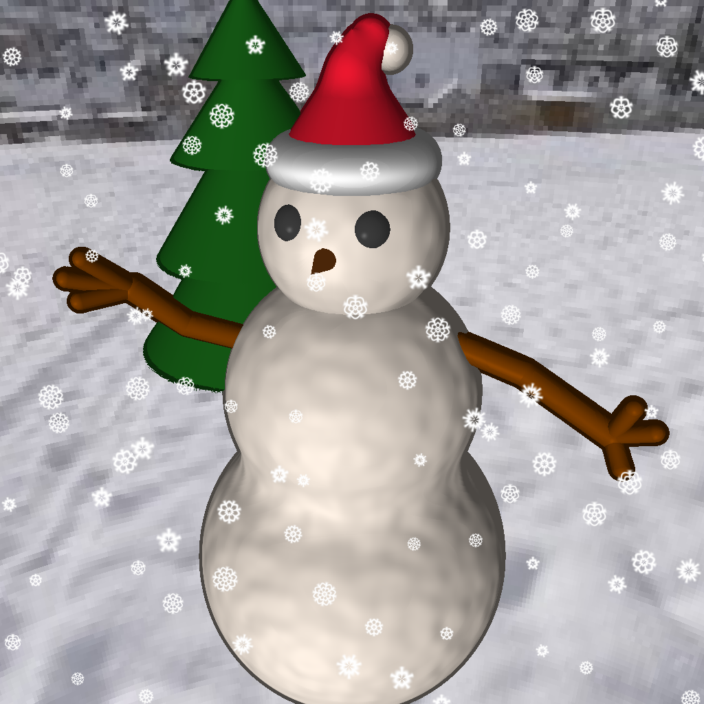

# Snowkolov

Projet d'infographie M1 Informatique 2024, dont le but est de générer une image de bonhomme de neige.
Nous avons choisi d'utilisé la méthode dite de "sphere tracing" pour générer l'image afin d'utiliser des fonctions implicites.

## Lancer le projet

### Prérequis

- [CMake](https://cmake.org/)
- [gcc](https://gcc.gnu.org/)
- [git](https://git-scm.com/)

> [!IMPORTANT]
> Ce projet utilise la librairie [glm](https://github.com/g-truc/glm) en tant que sous-module git. Faites attention à bien cloner le projet avec les sous-modules.

### Compilation

```bash
mkdir build
cd build
cmake ..
make
```

### Utilisation

> [!TIP]
> Retournez à la racine du projet pour lancer le programme afin d'éviter de dupliquer les ressources dans le dossier build.

```bash
cd ..
./build/snowkolov
```

> [!NOTE]
> une image `out.png` est générée dans le dossier depuis lequel vous avez lancé le programme.

## Résultat



## Auteurs

|  |  |
| :---: | :---: |
| [Antonin ROUSSEAU](https://github.com/toxicbloud) | [Paul Loisil](https://github.com/furwaz) |
